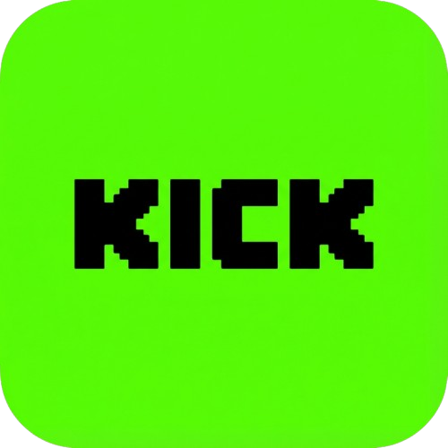
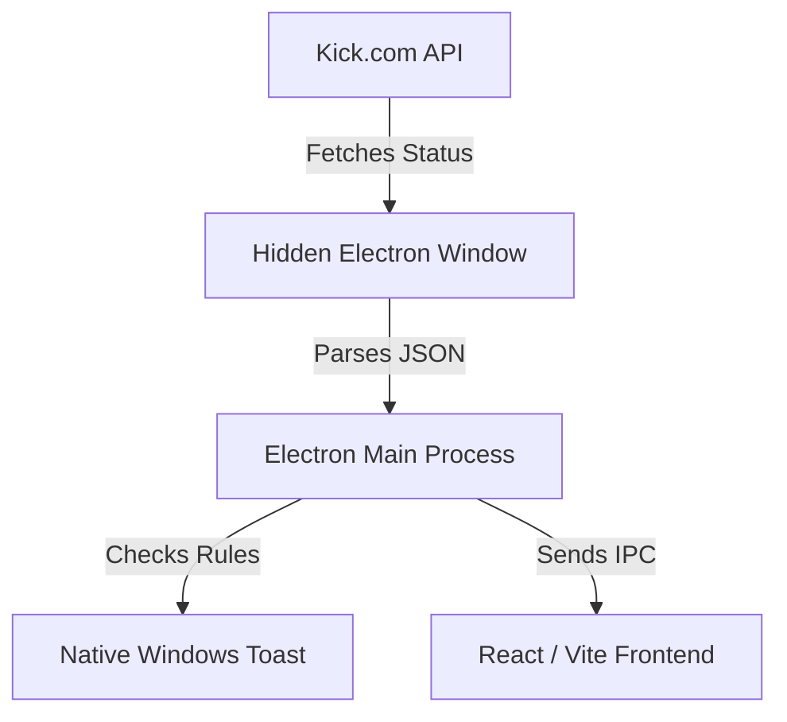

<div align="center">
  

  # Kick Notifier Pro
  
  *Desktop application that monitors Kick streamers and sends instant native notifications when they go live.*

  [Download Latest Release](https://github.com/GorkemKK/kick-notifier-pro/releases/latest) | [Report Bug](https://github.com/GorkemKK/kick-notifier-pro/issues) | [Request Feature](https://github.com/GorkemKK/kick-notifier-pro/issues)

  <br />

  
  
  
</div>

---

## Statistics & Highlights

- Built with **TypeScript**, **React 18** and **Electron**
- Native Windows desktop notifications
- Background auto-update system
- Concurrent Web Worker Pool architecture for blazingly fast API polling

---

## Why?

Many Kick users miss streams from their favorite creators because they either forget to check or don't want to rely on bloated browser extensions. 

**Kick Notifier Pro** was built to solve this problem. It provides lightweight, real-time desktop notifications without requiring a browser to be open. It sits quietly in your system tray and alerts you the exact moment your favorite streamer goes live.

---

## Features

| Feature | Status |
| :--- | :---: |
| **Live Stream Detection** | ✅ |
| **Native Windows Desktop Notifications** | ✅ |
| **Custom Notification Sounds** | ✅ |
| **Auto-Updater System (Background)** | ✅ |
| **System Tray Integration** | ✅ |
| **Glassmorphism UI & Dynamic Sorting** | ✅ |
| **Precise Custom Polling Intervals** | ✅ |
| **Verified Channel Badges & Follower Counts** | ✅ |
| **Kick Account Synchronization** | ✅ |
| **Live Search Auto-Suggestions** | ✅ |
| **Streamer Muting & Memory List** | ✅ |
| **Bilingual Support** | EN / TR |

---

## Download

Get the latest version and start tracking your favorite streamers immediately!

[**Download Latest Windows Release (.exe)**](https://github.com/GorkemKK/kick-notifier-pro/releases/latest)

> [!NOTE]
> **Windows SmartScreen Warning**
> Since this is an open-source project without a paid code signing certificate, Windows Defender SmartScreen might show a blue warning saying "Windows protected your PC" on the first launch. Simply click **More info** -> **Run anyway**. This is completely normal for indie open-source apps.

---

## Screenshots

<div align="center">
  
</div>

<details>
<summary>Click to see more screenshots</summary>
<br>
  
  
  <br />
   
   
  
</details>

---

## Architecture

The app uses a **Concurrent Web Worker Pool Mechanism** to fetch data from Kick's API securely without triggering Cloudflare blocks, while reusing a limited pool of background windows to prevent out-of-memory (OOM) errors and drastically speed up synchronization.



---

## Tech Stack

**Frontend:**
- HTML, CSS, TypeScript
- React 18
- TailwindCSS (Styling)
- Framer Motion (Animations)

**Desktop Core:**
- Electron
- Node.js

**Build & Deployment:**
- Vite
- Electron-Builder
- Electron-Updater

---

## Project Structure

```text
kick-notifier-pro/
├── electron/
│   ├── main.ts        # Main Electron process & Auto-Updater
│   └── preload.ts     # IPC bridge
├── public/
│   └── assets/        # Icons and sounds
├── src/
│   ├── components/    # React components (Modals, Toasts)
│   ├── App.tsx        # Main React Entry
│   └── index.css      # Tailwind config & styling
└── package.json       # Dependencies & Build config
```

---

## Roadmap

- [x] Initial release with stream monitoring
- [x] Glassmorphism UI & sorting features
- [x] Auto-updater background engine
- [x] Verified channel badges & follower counts
- [x] Launch on startup option
- [ ] Kick account integration to automatically sync followed channels
- [ ] Notification history log
- [ ] Discord Webhook support for automatic server announcements
- [ ] Cross-platform support (macOS & Linux binaries)

---

## Development (For Developers)

Want to build it yourself? 

```bash
# 1. Clone the repository
git clone https://github.com/GorkemKK/kick-notifier-pro.git

# 2. Install dependencies
npm install

# 3. Run in development mode
npm run dev

# 4. Build executable
npm run build
```

---

## License

This project is open-source and available under the [MIT License](LICENSE). Feel free to fork, modify, and improve it!
